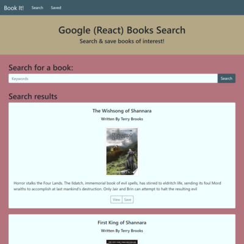

# [21-book-search](https://github.com/MichelleMcConville/21-book-search) 🔗


## Description

A Google 📖 Books Search App using React

| ***Search Page***                 | ***Saved Page***                 |
| --------------------------------- | -------------------------------- |
|  |  |

## Table of Contents ✨

* [Repository](#repo)
* [Installation](#installation)
* [Usage](#usage)
* [Contributing](#contributing)
* [Tests](#tests)
* [Questions](#questions)
* [License](#license)

## Repository ⚙️ <a name="repo"></a>

> https://github.com/MichelleMcConville/21-book-search

## Installation 🛠️ <a name="installation"></a>

```.
Just a Website. No installation required.
```

## Usage ⚙️ <a name="usage"></a>

```.
Select the link below & enjoy!
```

> [Google Book Search](https://mchel-book-search.herokuapp.com/) 🔗

## Contributing 🤝 <a name="contributing"></a>

All contributions must be approved by the owner

## Tests ✅ <a name="tests"></a>

There are currently no testing procedures for this application

## Questions ❓ <a name="questions"></a>

* 📧 If you have any questions please [**eMail**](mailto:dev.mchel@gmail.com) me
* :octocat: Check out more of my work on [**GitHub**](https://github.com/MichelleMcConville)

## License 📝 <a name="license"></a>

This project is **`Creative Commons`** licensed

---

 Copyright ©️ 2021 🌷 Michelle McConville
